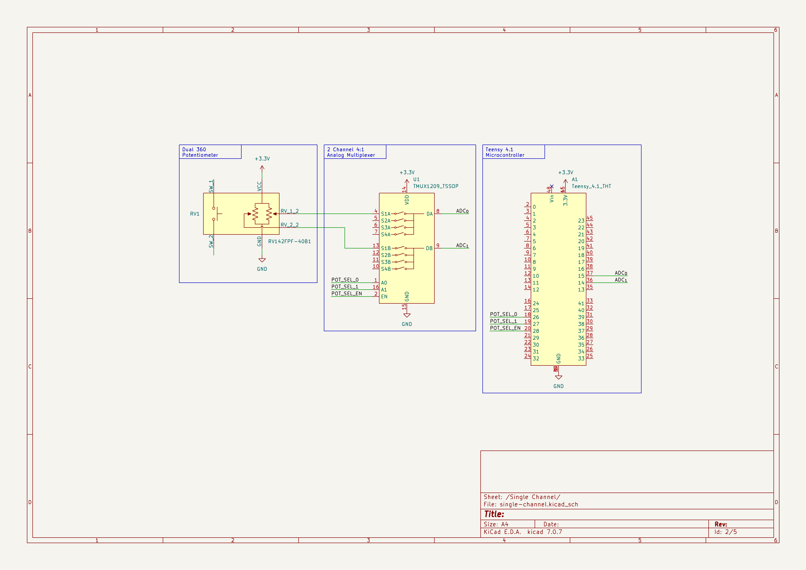

# POTENTIOMETER SUBCIRCUIT

## Components Used

### Rotary Potentiometers

## Knob Functional Description
The knobs are configured in 3 rows of 8 each. Each knob has 2 analog outputs, 1 for each potentiometer. So we need to measure a total of 48 analog outpus. This is done using 12 analog inputs on the Teensy 4.1 microcontroller. 6 multiplexers are used, each has 2 channels of 4:1 multiplexers. We will build up the circuit in the examples below so that it's clear what each component is doing. The potentiometers use the 3.3V supply taken from the Teensy's 3.3V regulated output.

### Single Potentiometer Example
Each rotary potentiometer has one of its 2 potentiometer tap pins connected to a channel in a multiplexer. This way, the microcontroller will always be able to "see" both outputs of a single device simultaneously and get an instantaneous measure. The two outputs of the multiplexer are connected to two independent ADC channels on the microcontroller.

### Multiple Rotary Potentiometer Example
Adding a second rotary potentiometer, we simply connect its 2 outputs to the second position on each channel of the multiplexer. When the multiplexer switches positions, the microcontroller will now be reading the output from the second device.

### Multiple Multiplexer Example
The above example will only scale to 4 rotary potentiometers (one for each position on the 4:1 switches). In order to add more devices, we must add more multiplexers. Each additional multiplexer requires 2 more analog inputs on the microcontroller. The Teensy 4.1 is a great choice because it has 18 pins that can be used as analog inputs. We use 12 in this design to measure the full array of 24 rotary potentiometers.

### Final Circuit Design
The image below, extacts each element of the potentiometer circuit into a signle drawing. In the real design, potentiometers and multiplexers are housed on one PCB, and the controller is on a second PCB. These boards are connected with a high density connector which is also shown in the drawing. All reference designators and pin labels are the same as the full schematic so this image can be used as a simplified reference for the full schematic drawing.

## Pushbutton Functional Description
