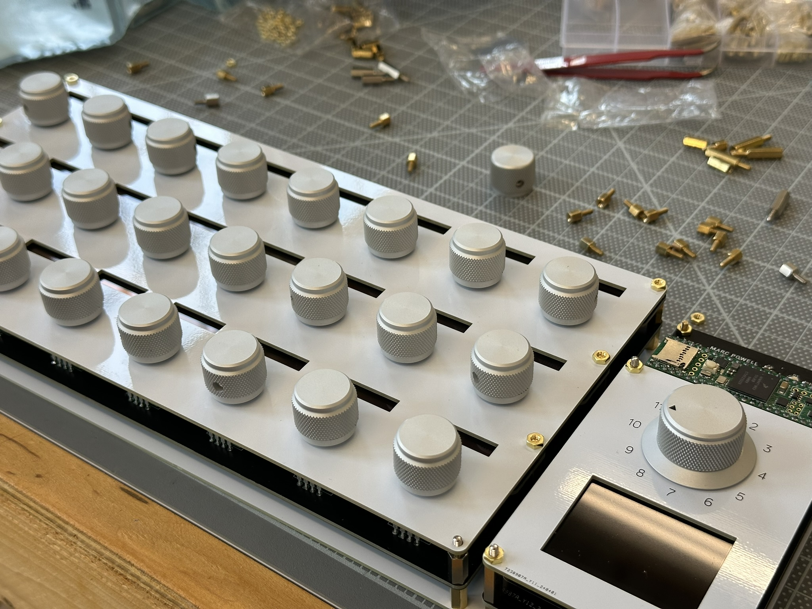

# Project Overview

## Description
I wanted a way to control my photo editing software using a physical control panel with knobs dedicated to individual settings. Using a plugin for lightroom called [MIDI2LR](https://rsjaffe.github.io/MIDI2LR/), you can use any MIDI controller to change parameters within Adobe Lightroom. However, I was not able to find a MIDI controller with the specifications I wanted for my workflow, so I decided to build my own!

## Key Differentiators
So what makes my device so special? Why did I take the time to build my own version? Here are a few key differences between what I've built and the other solutions on the market.

1. High quality knurled aluminum knobs and smooth potentiometers and encoders that give a much more premium tactile feel
2. Special 360&deg; analog "rotary potentiometers" *without detents* ([Alpha Taiwan RV142FPF](https://www.taiwanalpha.com/en/products/4)) instead of typical detented, digital rotary encoders
3. Unique "digital labels" that uses a small OLED display for each control which indicate what the knob controls and changes when different modes are selected
4. 12-layer design with 12 individually selectable modes, each providing a unique function for all knobs on the controller along with a dedicated display indicating the selected layer with labels
5. A 3 row x 8 knob layout that matches well with common menus in Lightroom

## Alternative Options
There are a number of MIDI controllers that people like to pair with MIDI2LR. Some of the most popular are:

- [Behringer X-Touch Mini](https://www.behringer.com/product.html?modelCode=0808-AAF)
- [Behringer X-Touch Compact](https://www.behringer.com/product.html?modelCode=0808-AAE)
- [DJ Techtools Midi Fighter Twister](https://store.djtechtools.com/collections/midi-fighters-midi-fighter-accessories/products/midi-fighter-twister)
- [Faderfox EC4](https://faderfox.de/ec4.html)
- [Arturia BeatStep](https://www.arturia.com/products/hybrid-synths/beatstep/overview)

There are also a few options designed off-the-shelf for controlling Lightroom and other creative software. These even come with their own drivers and plugins:

- [Loupedeck CT](https://loupedeck.com/us/products/loupedeck-ct/)
- [Loupedeck+](https://loupedeck.com/us/products/loupedeck-plus/)
- [TourBox Neo](https://www.tourboxtech.com/en/tourbox-neo/)
- [Monogram Photo Console (formerly Palette)](https://monogramcc.com/shop/products/photo-console/)

I have tried a number of these including the Behringer X-Touch Mini, Midi Fighter Twister, and Loupedeck CT. But none worked for my specific wants.

## Summary
This is the documentation for the full project build including circuit designs and code. Please see the project GitHub for the source files and documents.
